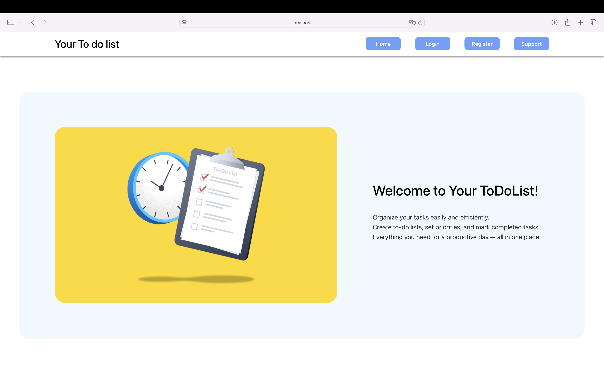
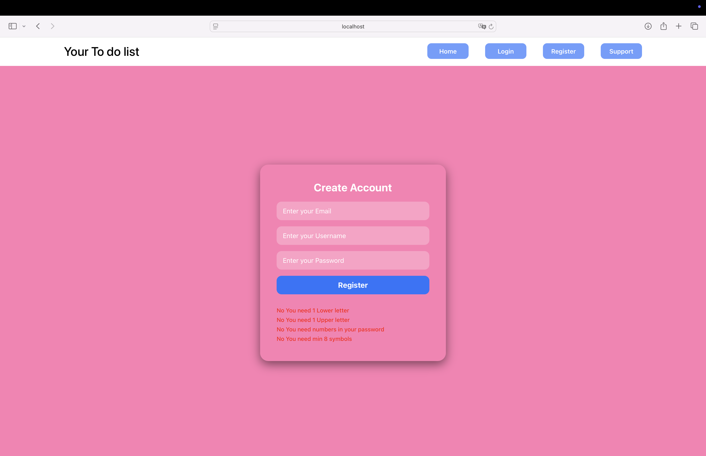
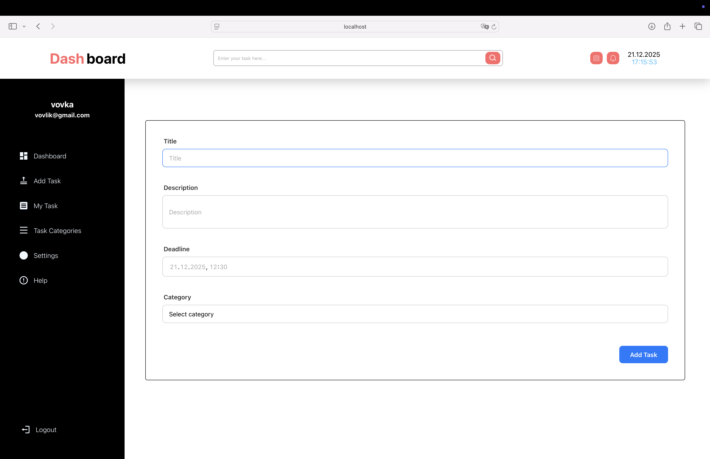
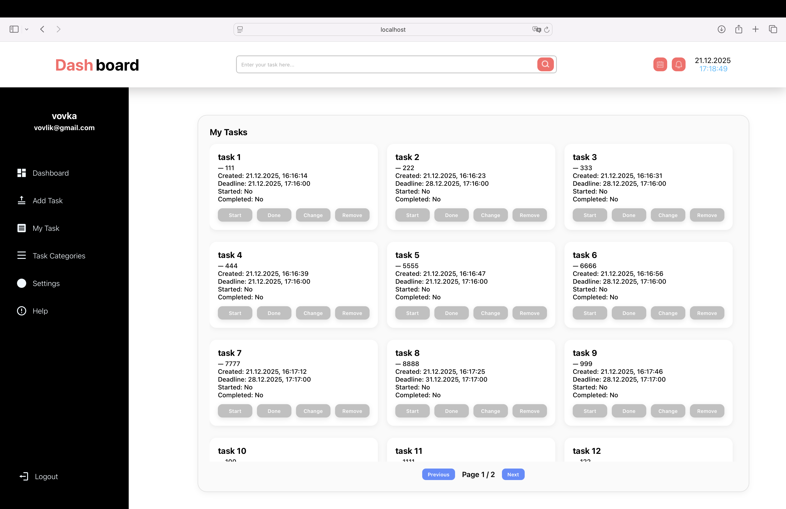
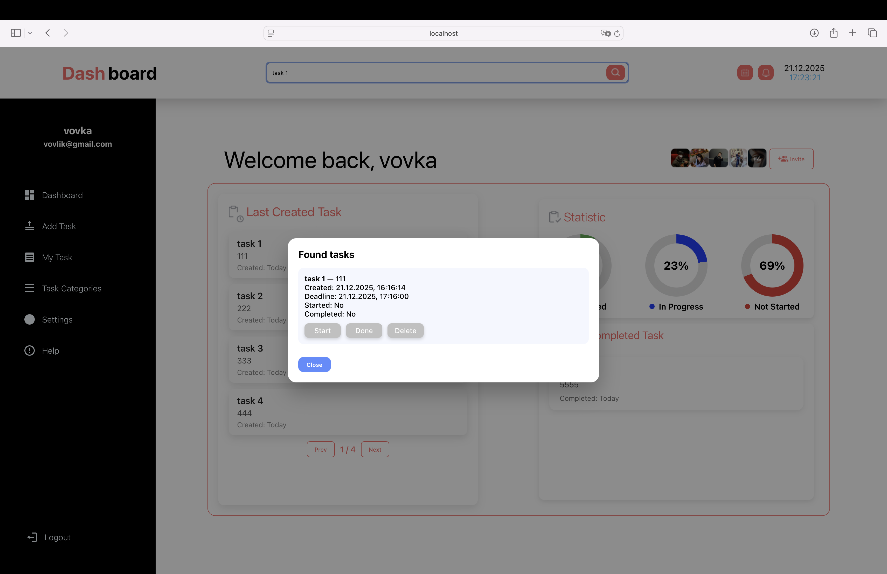
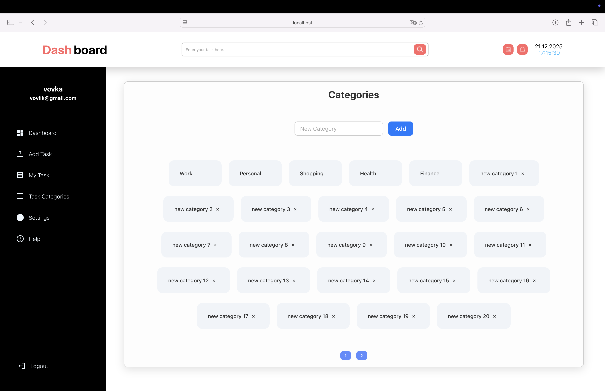
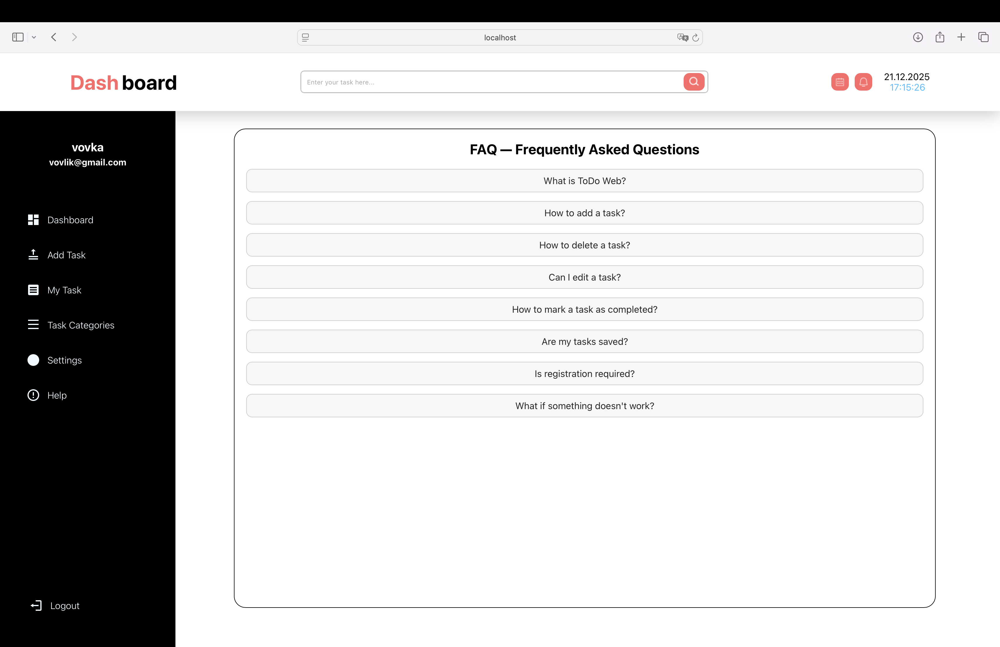
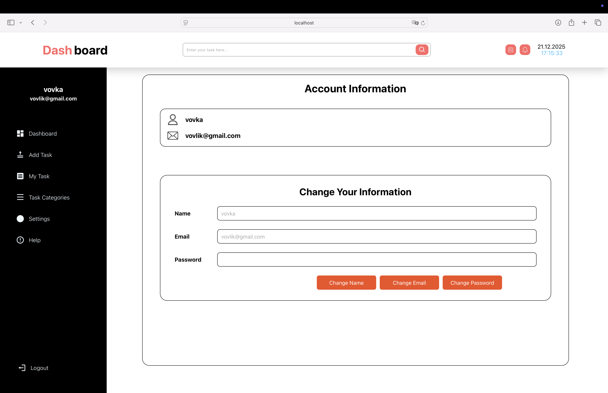
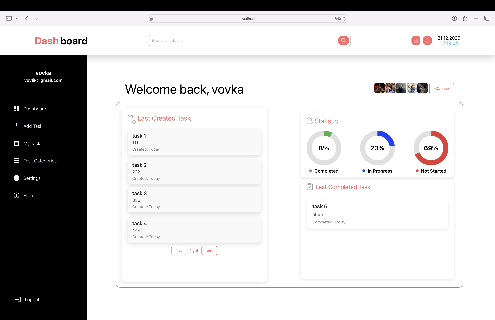

# 📝 ToDo FullStack Project

## 🚀 Project Description
**ToDo FullStack Project** is a full-featured task management application that allows users to:

- ➕ Create, edit, and delete tasks  
- ✅ Mark tasks as completed  
- 📊 View detailed task statistics  
- ⚙️ Configure application settings  
- 🌐 Work across multiple devices using ngrok  

The app is designed to be user-friendly, responsive, and intuitive, making task management seamless.  
**Note:** Only screenshots are provided for demonstration purposes. The project runs locally, so it cannot be opened directly online.

---

## 🖼 Application Screenshots

<table>
<tr>
<td> Main Page</td>
<td> Register Page</td>
</tr>
<tr>
<td> Login Page</td>
<td> Add Task</td>
</tr>
<tr>
<td> My Tasks</td>
<td> Found Tasks</td>
</tr>
<tr>
<td> Categories</td>
<td> Help</td>
</tr>
<tr>
<td> Settings</td>
<td> User Dashboard</td>
</tr>
</table>

---

## 🛠 Technologies Used
**Frontend:** HTML, CSS, JavaScript (or React/Vue/Angular)  
**Backend:** Node.js (Express)  
**Ngrok:** for cross-device interaction  
**Node.js / npm:** for running the project  

---

## ⚡ Features
- ➕ Add new tasks  
- ✏️ Edit existing tasks  
- ✅ Mark tasks as completed  
- ❌ Delete tasks  
- 📊 View task statistics  
- ⚙️ Configure application settings  
- 🌐 Work across devices via ngrok  
- 📱 Intuitive user interface  

---

## 📌 How to Run and Use the Project

1. Download or clone the project from GitHub.  
2. Make sure **Node.js** and **npm** are installed.  
3. Install the project dependencies using **`npm install`**.  
4. Start the development server with **`npm run dev`**.  
5. Open your browser and go to **`http://localhost:3000`** to access the app locally.  
6. To use the app on multiple devices, run **ngrok** with **`ngrok http 3000`** and open the provided link on other devices.  
7. Once the app is running, you can:  
   - Add new tasks using the **Add Task** button  
   - Edit and delete existing tasks  
   - Mark tasks as completed  
   - View task statistics  
   - Configure app settings  

**Important:** The project runs only locally. The screenshots in this README demonstrate the functionality, but the application cannot be accessed online.

---

## 🔮 Future Enhancements
- User authentication and roles  
- Notifications and reminders  
- Dark mode / theming options  
- Drag-and-drop task management  
- Advanced statistics and charts  
- Mobile-friendly responsive design improvements  

---

## 🎯 Project Goals
- Practice full-stack development  
- Build a practical ToDo application with real-world features  
- Visualize and track task completion statistics  
- Enable cross-device collaboration via ngrok  

---

## 🧑‍💻 Author
**Name:** Volodymyr  
**GitHub:** [vovlikk](https://github.com/vovlikk)  
